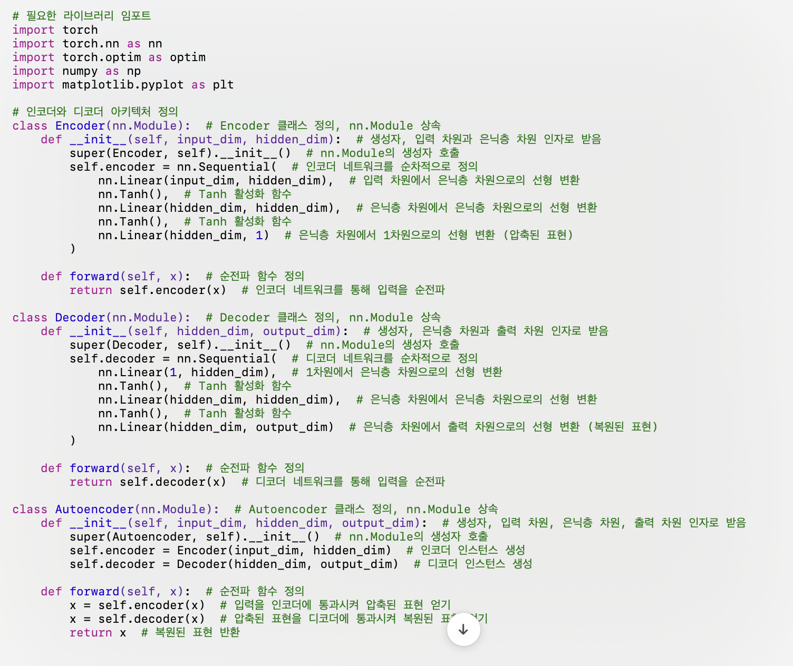
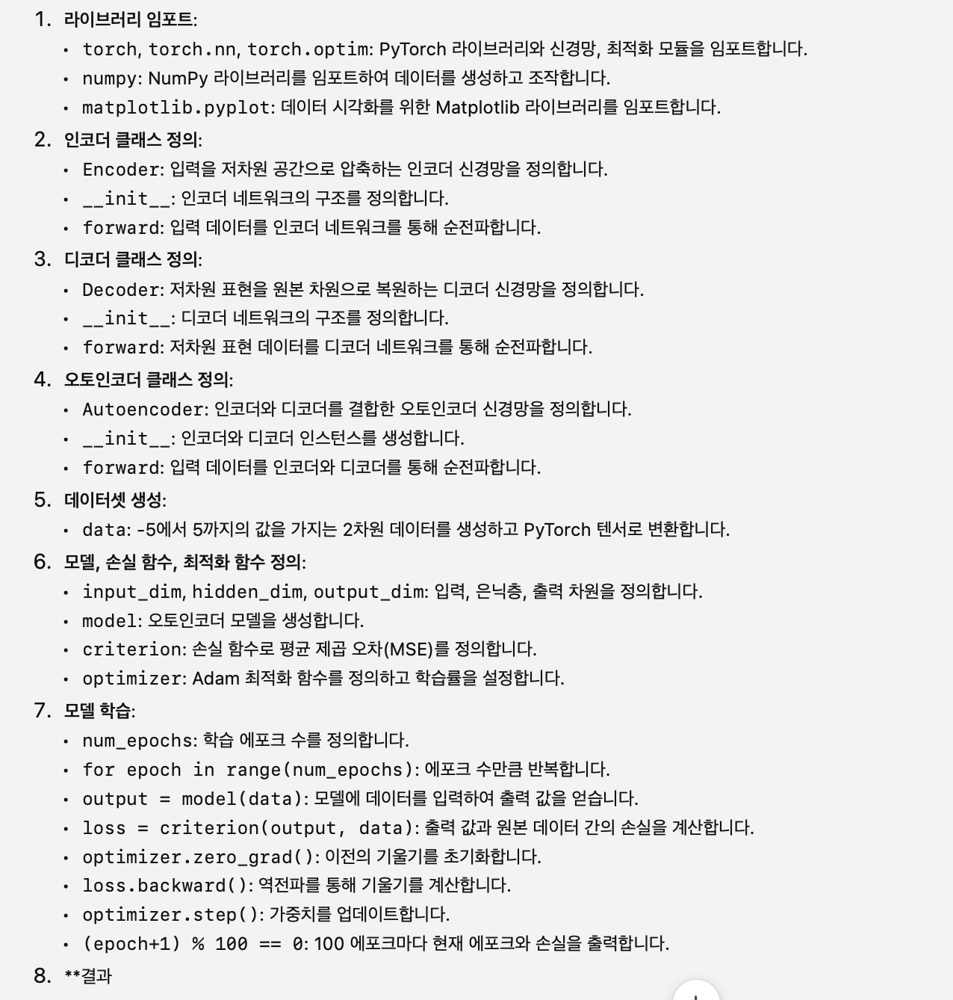
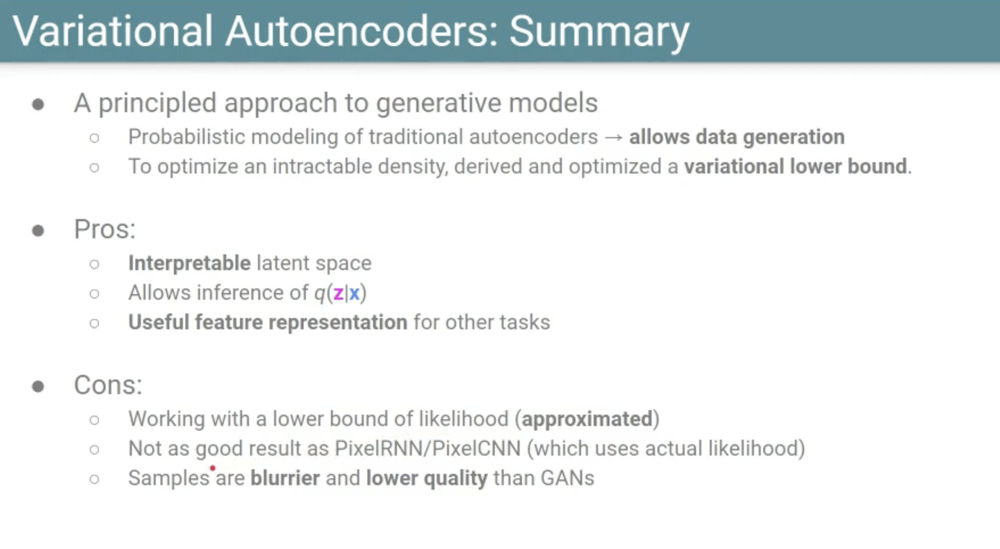

- TREND
	- 뉴스 https://news.hada.io/topic?id=15283
		- 1. 애플 2024년 WWDC > 시총1위, macOS Sequoia Developer Beta
			- 0). LoRA 어댑터 블로그중
				- 우리는 사전 훈련된 모델의 다양한 계층에 연결할 수 있는 작은 신경망 모듈인 어댑터를 활용하여 특정 작업에 맞게 모델을 미세 조정합니다
			- 
			- 1).  https://machinelearning.apple.com/research/introducing-apple-foundation-models
			- 2. 애플기기간 클러스트링 https://x.com/ronaldmannak/status/1801991130642542915
			- 
			- 
			- 
			- 
			- 3. 애플과 chatGPT 계약
				- 
				- 
				- https://www.pymnts.com/apple/2024/report-apple-paying-openai-with-exposure-and-not-cash/
		- 2. NVIDIA 오픈모델
			- Nemotron-4 340B 허깅페이스 (mmlu(Massive Multitask Language Understanding) 기준 78.7)
			- https://blogs.nvidia.com/blog/nemotron-4-synthetic-data-generation-llm-training/
			- NVIDIA는 오늘 개발자가 의료, 금융, 제조, 소매 및 기타 모든 산업 전반의 상용 애플리케이션을 위한 대규모 언어 모델(LLM) 훈련을 위한 합성 데이터를 생성하는 데 사용할 수 있는 개방형 모델 제품군인 Nemotron-4 340B를 발표했습니다.
		- 3. OPENAI - NSA
			- 
		- 4. MoA
			- https://www.together.ai/blog/together-moa
		- 5. hallo
			- https://github.com/fudan-generative-vision/hallo
		- 6. ms recall 이슈
			- https://www.aitimes.com/news/articleView.html?idxno=160642
		- 7. adobe 약관논란
		- 8. 하버드 실제 쥐처럼 움직일수있는 인공지능 프로그램 - 실제논문(생쥐실험)
		- 9. AI사진대회에서 진짜사진이 우승
		- 10. 루마ai, 드림어쩌고 영상 (소라퀄리티)
		- * 시총 사이트
			- https://companiesmarketcap.com
			- https://top.hibuz.com/
	- VAE란 무엇인가 : Variational Auto Encoder
		- 기본 논문은 Kingma와 Welling의 "Auto-Encoding Variational Bayes"
			- 2013년, 딥러닝과 확률 모델을 결합한 혁신적인 접근 방식으로 평가
		- 오토인코더는 모델이 잠재변수(latent variables)의 더 낮은차원으로 압축후
		- 다시 원래차원으로 복원하는 구조
		- VAE는 이 과정에서 확률적인 요소를 추가, 단순히 압축후 복원하는것이 아니라
		- 입력데이터의 확률적인 분포 모델링
	- AE란 무엇인가 : Auto Encoder
	- E란 무엇인가 : Encoder : VAE를 이해하기 위한 기초
		- {{video https://www.youtube.com/watch?v=WLCDkfFXbj0&t=1s}}
		- 원본데이터보다 더 적은 숫자로 나타내는것
		- 
		- 
		- 수동인코더
		- 
		- 
		- {:height 563, :width 719}
		- 
		- 
		- 
		- 이런걸 다 짜야함, 2차원이 이런데... 32*32픽셀은 RGB세개색깔> 3072차원 
		- 
		- 
		- 
		- 
		- 
		- 
		- 
		- 
		- 
		- 
		- 
		- 
		- 
		- 샘플원
		  autoencoder_example.ipynb
		- {:height 612, :width 719}
		- 
		- {:height 762, :width 719}
		- 샘플투
		  simple_autoencoder_example.ipynb
	- 왜 Variational이라는 용어가 사용되는가?
		- 모델이 잠재변수(latent variables)의 사후확률분포를 근사하는 방식을 설명
			- 사후확률분포란?(posterior probability distribution), 베이지안 통계에서 중요한 역할을 하는 개념
				- 주어진 데이터 D가 관찰된 후 매개변수 세타의 불확실성을 수량화하는 확률분포
				- 이분포는 데이터가 주어진 맥락에서 매개변수의 확률을 업데이트하고 재평가하는 데 사용
				- p(θ∣D)=p(D)p(D∣θ)×p(θ)​
				- 
				- 
				- ### 사후 확률 분포의 중요성
				  사후 확률 분포는 데이터를 관찰한 후 매개변수의 불확실성을 이해하고, 이를 기반으로 예측이나 결정을 내릴 때 중요하게 사용됩니다. 예를 들어, 의학적 진단, 주식 시장의 미래 가치 예측, 기후 변화에 대한 모델링 등 다양한 분야에서 사후 확률 분포는 필수적입니다.
				  데이터 과학 및 인공 지능 분야에서 사후 확률 분포는 모델의 매개변수를 추정하고, 예측의 불확실성을 계산하는 데 필수적입니다. 이는 모델의 해석과 응용에 깊이를 더하며, 실제 세계 데이터에 대한 더 강력하고 신뢰할 수 있는 결론을 도출할 수 있게 합니다.
				- 
				- {{video https://www.youtube.com/watch?v=d7ZONh-HPdo}}
			- 
		- 요약
		- VAE는 잠재 변수의 사전 확률 분포와 결합하여, 간단하고 계산 가능한 분포로 사후 확률 분포를 근사
		- 근사 방식이 바로 '변분 추론'(Variational Inference)
			- 최적화 문제로 접근하여 잠재변수의 실제사후분포와 가장 비슷한 함수형태의 분포를 찾는다.
			- VAE는 잠재공간의 각 포인트가 평균과 분산으로 표현되는 정규분포로 가정, 이러한 정규분포의 매개변수들을 학습하는 구조
		- 
		- 
		- 
		- 
		- 
		- 
		- 
		- 출처: {{video https://www.youtube.com/watch?v=MuTibPS09wQ}}
	- https://chatgpt.com/share/4d43f74f-c1e4-4c73-a7d1-81eedfecf8e8
	- 이해하고싶으나...
	- https://gaussian37.github.io/dl-concept-vae
	- 이번주 주요논문
		- https://discuss.pytorch.kr/t/2024-06-10-06-16-ml-top-ml-papers-of-the-week/4648
	-
	-